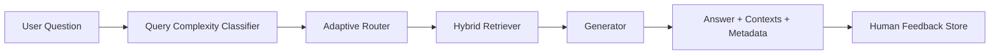

# Architecture

Core interfaces:

- `QueryClassifier.predict(query) -> complexity_label`
- `Retriever.search(query, top_k, mode) -> contexts`
- `AdaptiveRouter.route(query) -> rag_strategy`
- `RAGPipeline.answer(query) -> answer, contexts, metadata`
- `Evaluator.evaluate(dataset) -> metrics`

