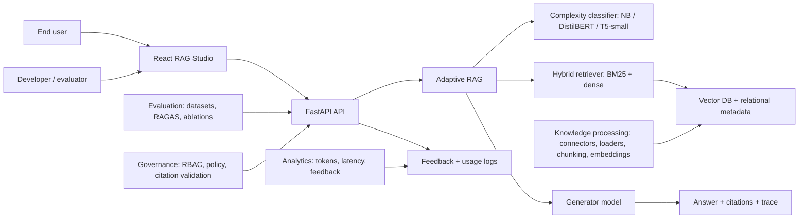

# Architecture

## Layers

- Application layer: React RAG Studio, chatbot, API access and analytics dashboard.
- Adaptive RAG layer: route decision, complexity classifier, retriever, post-retriever, prompt assembly and generator.
- Knowledge processing layer: local upload and website connectors, loader registry, metadata extraction, deduplication, chunking, embedding and index management.
- Storage layer: PostgreSQL relational metadata, pgVector chunk embeddings, chat history, configuration, usage and audit logs.
- Model farm layer: classifier models, embedding models, rerankers and generator models.
- Governance layer: RBAC, policy checks, hallucination detection and citation validation.

Core interfaces:

- `QueryClassifier.predict(query) -> complexity_label`
- `Retriever.search(query, top_k, mode) -> contexts`
- `AdaptiveRouter.route(query) -> rag_strategy`
- `RAGPipeline.answer(query) -> answer, contexts, metadata`
- `Evaluator.evaluate(dataset) -> metrics`

Knowledge ingestion interfaces:

- `KnowledgeService.ingest_uploaded_file(kb_id, filename, bytes) -> ingestion_summary`
- `KnowledgeService.ingest_website(kb_id, url) -> ingestion_summary`
- `KnowledgeService.create_document/update_document/delete_document(...)` manages documents inside a selected knowledge base and regenerates affected chunks/embeddings.
- `KnowledgeRepository` stores knowledge bases, data sources, documents, chunks, embeddings and ingestion runs.
