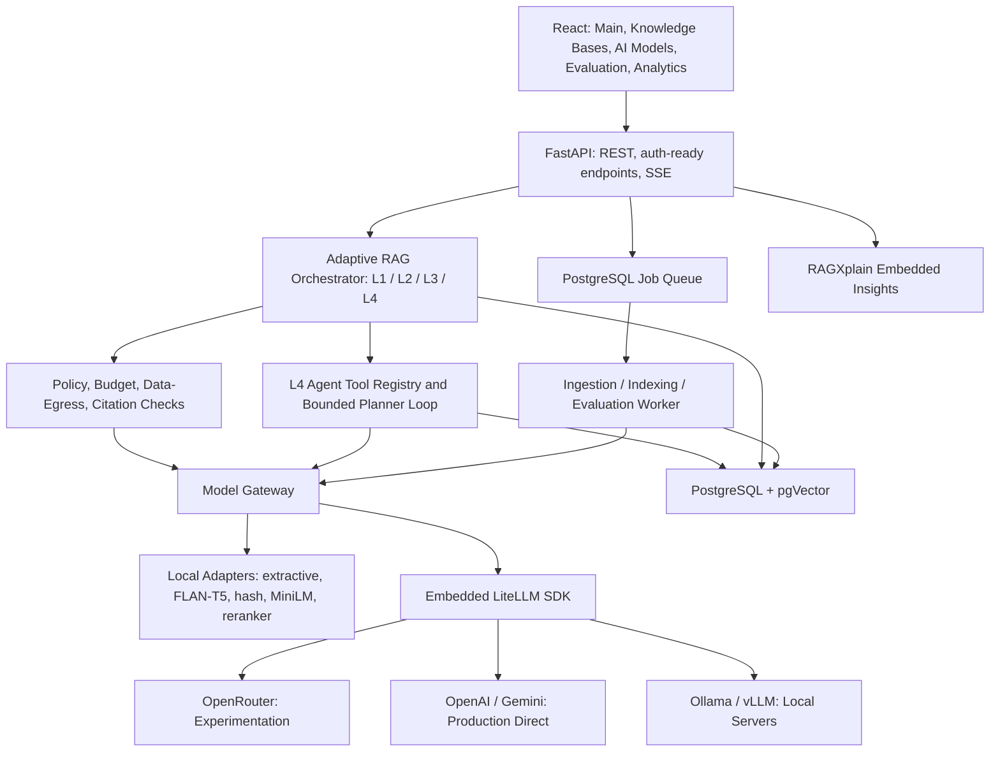

# Architecture

```mermaid
flowchart TB
    UI["React: Main, Knowledge Bases, AI Models, Evaluation, Analytics"]
    API["FastAPI: REST, auth-ready endpoints, SSE"]
    RAG["Adaptive RAG Orchestrator: L1 / L2 / L3 / L4"]
    AGENT["L4 Agent Tool Registry and Bounded Planner Loop"]
    POLICY["Policy, Budget, Data-Egress, Citation Checks"]
    GATEWAY["Model Gateway"]
    LOCAL["Local Adapters: extractive, FLAN-T5, hash, MiniLM, reranker"]
    LITELLM["Embedded LiteLLM SDK"]
    OR["OpenRouter: Experimentation"]
    DIRECT["OpenAI / Gemini: Production Direct"]
    SERVERS["Ollama / vLLM: Local Servers"]
    STORAGE["PostgreSQL + pgVector"]
    JOBS["PostgreSQL Job Queue"]
    WORKER["Ingestion / Indexing / Evaluation Worker"]
    RAGX["RAGXplain Embedded Insights"]

    UI --> API
    API --> RAG --> POLICY --> GATEWAY
    RAG --> AGENT
    AGENT --> STORAGE
    AGENT --> GATEWAY
    GATEWAY --> LOCAL
    GATEWAY --> LITELLM
    LITELLM --> OR
    LITELLM --> DIRECT
    LITELLM --> SERVERS
    RAG --> STORAGE
    API --> JOBS --> WORKER
    WORKER --> GATEWAY
    WORKER --> STORAGE
    API --> RAGX
```

## Layers

- Application layer: React RAG Studio, Knowledge Bases, AI Models, Evaluation, Analytics, and API access.
- Adaptive RAG layer: policy check, calibrated four-class classification, L1/L2/L3/L4 routing, retrieval, optional reranking, bounded agent tools, prompt assembly, generation, citation validation, persistence, and telemetry.
- Knowledge processing layer: local upload and website connectors, loader registry, metadata extraction, deduplication, real chunking strategies, embedding, and active index management.
- AI Models layer: reusable provider connections plus admin-registered deployments for generation, embedding, rerank, judge, planner, and classifier capabilities.
- Model Gateway layer: local adapters plus embedded LiteLLM for paid/hosted providers, normalized errors, budget checks, data-egress policy, usage events, and optional fallbacks.
- Storage layer: PostgreSQL relational metadata, dimension-aware pgVector chunk embeddings, chat history, configurations, jobs, users, model connections/deployments, usage, evaluation, and audit-friendly metadata.
- Worker layer: durable PostgreSQL jobs for ingestion, indexing, and evaluation using leases and retry metadata.
- Governance layer: JWT-ready roles, secret redaction, external-processing controls, hard budgets, and citation validation.

Core interfaces:

- `QueryClassifier.predict(query) -> complexity_label`
- `QueryClassifier.predict_scored(query) -> label, probabilities, confidence, margin`
- `Retriever.search(query, top_k, mode) -> contexts`
- `AdaptiveRouter.route(query) -> rag_strategy`
- `RAGPipeline.answer(query) -> answer, contexts, metadata`
- `Evaluator.evaluate(dataset) -> metrics`
- `AgentToolRegistry.list_tools() -> availability and authorization metadata`

Adaptive routes:

| Complexity | Route | Runtime |
|---|---|---|
| `simple` | L1 Direct | Generation without retrieval |
| `moderate` | L2 Simple RAG | One retrieval pass and generation |
| `complex` | L3 Complex RAG | Decomposition, multi-query retrieval, aggregation, generation |
| `advanced` | L4 Advanced RAG | Bounded planner/tool loop with L3 fallback |

L4 is an Aragbiz research extension. The referenced Adaptive-RAG method defines three strategies; Aragbiz preserves its least-complex-successful-route principle while adding a fourth agentic tier. L4 planners receive only currently available tools. Google Drive, OneDrive, and database descriptors remain unavailable and are excluded from planner prompts.

Knowledge ingestion interfaces:

- `KnowledgeService.ingest_uploaded_file(kb_id, filename, bytes) -> ingestion_summary`
- `KnowledgeService.ingest_website(kb_id, url) -> ingestion_summary`
- `KnowledgeService.create_document/update_document/delete_document(...)` manages documents inside a selected knowledge base and regenerates affected chunks/embeddings.
- `KnowledgeRepository` stores knowledge bases, data sources, documents, chunks, embeddings and ingestion runs.

AI Models interfaces:

- `ModelGateway.generate(messages, deployment_id, ...) -> ModelGenerationResult`
- `ModelGateway.stream(messages, deployment_id, ...) -> ModelStreamEvent`
- `ModelGateway.embed(texts, deployment_id, ...) -> ModelEmbeddingResult`
- `ModelGateway.rerank(query, documents, deployment_id, top_n) -> ModelRerankResult`
- `ModelAdapter` defines provider-neutral generation, streaming, embedding, and reranking behavior.
- `LocalBuiltinAdapter` executes in-process extractive, FLAN-T5, hash, MiniLM, and lexical implementations.
- `LiteLLMAdapter` is the only inference HTTP boundary for OpenRouter, OpenAI, Gemini, Ollama, and vLLM.
- `ModelFarmService` validates connection identity, capabilities, encrypted credentials, budgets, egress policy, health, and usage.

Runtime model ID mapping:

| Connection | Stored model ID | LiteLLM model ID |
|---|---|---|
| OpenRouter | `google/gemma-...` | `openrouter/google/gemma-...` |
| OpenAI direct | `gpt-4.1-mini` | `gpt-4.1-mini` |
| Gemini direct | `gemini-2.5-flash` | `gemini/gemini-2.5-flash` |
| Ollama | `llama3.1` | `ollama_chat/llama3.1` |
| vLLM | server model name | `hosted_vllm/<model>` |

Indexing model:

- Each knowledge base stores an embedding deployment and external-processing policy.
- Re-indexing builds a draft `knowledge_index_versions` record and activates it only after chunking and embedding succeeds.
- Queries use the active index version and its embedding deployment so document vectors and query vectors stay compatible.
